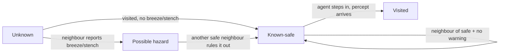

# Pumpkin Agents — ACS-204 Project Report

> Constructor University Bremen, ACS-204 Artificial Intelligence
> Team: Iaroslav Postovalov (solo)
> Deliverable: Minecraft (Paper 1.19.4) plugin that animates pumpkins as rational
> agents implementing every method on the course syllabus.

> *Self-referential footnote.* The small Kotlin DSL used for command
> registration — [plugin-api](https://gitlab.com/CMDR_Tvis/plugin-api) — is
> something I wrote in 2019–2020 (age 15–16). It still works on the current
> host runtime — after some version bumps and actualizations prompted by
> Kotlin's evolution since.

## 1. Introduction

We chose Minecraft as the substrate for a *thinking-rationally / acting-rationally*
exhibit (R&N §1, four paradigms). A pumpkin block on a flat world is a
mobile agent: it perceives the cells around itself, picks an action, and the
game's tick loop executes that action on the next tick. The world acts as both
simulator and renderer, so neither has to be written. The whole project is
**symbolic / GOFAI** (Good Old-Fashioned AI): search, adversarial reasoning, and propositional logic.

## 2. PEAS & Environment Characterization

| Phase           | Performance                                | Environment                                 | Actuators                | Sensors                                             |
|-----------------|--------------------------------------------|---------------------------------------------|--------------------------|-----------------------------------------------------|
| 0 — Situated    | Reach goal wool                            | Grid + walls, 1 agent                       | `MOVE_{N,E,S,W}`, `WAIT` | Full grid                                           |
| 1 — Moving      | Path length, nodes expanded, ms/decision   | Grid + walls + goals + terrain (snow, sand) | + `PICKUP`, `DROP`       | Full grid                                           |
| 2 — Interacting | Score in Pumpkin Tag                       | Grid + walls + 2 agents                     | as above                 | Full grid + opponent positions                      |
| 3 — Reasoning   | Safe-cells deduced before first wrong step | Wumpus grid (hidden pits, Wumpus)           | as above                 | Local 4-neighborhood: `Breeze`, `Stench`, `Glitter` |

The task-environment properties shift across phases. Observability goes from
fully observable in phases 0–2 to partially observable in phase 3 (local
percepts only). The environment is deterministic throughout, and discrete
everywhere — an integer `(x, z)` grid, four cardinal moves, finite cell types.
Phases 0–1 are episodic (single-objective) while 2–3 are sequential. It is
static in 0–1, semi-dynamic in 2 (the opponent moves), and static again in 3,
and it is single-agent in 0–1 and 3 but multi-agent in 2 (the competitive
Pumpkin Tag).

## 3. Architecture

Three layers, all in the `plugin/src/main/kotlin/` tree:

- Domain (game-engine-independent): `world/GridWorld.kt`,
  `agent/{Action, Percept, AgentState, Brain}.kt`,
  `agent/search/SearchProblem.kt`. Pure data classes and a single `Brain`
  contract — every brain implements one function that maps the latest
  percept to a chosen action, exactly the percept→action function of R&N §2.1.
- Brains: `agent/brains/`. Related algorithms share a file —
  `SearchBrain.kt` hosts BFS / DFS / UCS / A\*, `MinimaxBrain.kt` hosts
  Minimax and α-β, and `PrologBrain.kt` / `ReflexBrain.kt` stand alone. Every
  brain is unit-tested headlessly against the same `Percept` interface.
- Game integration: a plugin entry point enables the agent inside the
  host game, the `/pumpkin …` commands are wired up via a small DSL, and an
  `AgentRuntime` owns the live world and a `Scheduler` that applies actions
  atomically each tick.

The high-level loop, the same on every tick, is:


The catalog of brains lines up with the course phases. Each phase's brains
share the same `Percept → Action` contract but differ in what they reason over
(map, opponent, knowledge base):


Every decision tick is atomic: collect every agent's chosen action, resolve
conflicts deterministically (lower agent-id wins on shared cells), then apply
all moves in one pass.

Runs are reproducible. A configurable seed is logged at every plugin enable,
and all benchmark runs ship with their seed in the CSV.

## 4. Phase 0 — Situated Agents

`ReflexBrain` implements the textbook right-hand wall-following rule. State is
*only* the agent's facing direction (no map model). The corridor map shows the
brain runs at a steady 1 cell / scheduler step to the goal:

```
########
#......R     ← spawn at (1,1), wall on the left, follow the right hand
########
```

Performance: O(n) decisions to traverse n cells; works on any single-room
layout with the goal somewhere along the right wall.

## 5. Phase 1 — Moving Agents (Search)

Four uninformed and informed search brains share a common `SearchProblem` (the
R&N §3.1 five components) and a `Node`-based graph search:

- `BfsBrain` — frontier as FIFO, complete and optimal for uniform costs.
- `DfsBrain` — depth-first with cycle detection and a configurable depth cap.
- `UcsBrain` — Dijkstra: PQ keyed on `g`. Used on the `maze_s` map, whose
  `SNOW` patches (cost 3) sit among cost-1 floor so the choice between
  equal-step paths reveals itself in path *cost*.
- `AStarBrain` — PQ keyed on `g + h`. Three heuristics ship:
    - `manhattan` — admissible + consistent.
    - `euclidean` — admissible (looser bound).
    - `diagonalOvershoot` — deliberately *inadmissible* (`(manhattan * 3) / 2`).
      Demonstrates that admissibility is required for optimality: it drops the
      optimality guarantee, so although on `maze_s` it happens to land on the
      same path as BFS (see the table below), on adversarial layouts it returns
      a longer one.

Empirical comparison on `maze_s` (seed=1234, agent at `(1, 1)`, single decision
from the start state — brains replan each tick, so the *first* decision is the
most informative call):

| Brain           | Ticks to goal | Nodes expanded (1st decision) | Max frontier |
|-----------------|---------------|-------------------------------|--------------|
| BFS             | 26            | 146                           | 11           |
| DFS             | did-not-reach | 27                            | 18           |
| UCS (cost)      | 26            | 147                           | 14           |
| A\* (Manhattan) | 26            | 67                            | 32           |
| A\* (Euclidean) | 26            | 132                           | 33           |
| A\* (overshoot) | 26            | 29                            | 16           |

A\* with the admissible Manhattan heuristic expands roughly **half** the nodes
of BFS while finding the same 26-step path. The Euclidean heuristic is also
admissible but a looser bound, so it expands almost twice as many nodes as
Manhattan. DFS hits its depth cap on `maze_s` and gives up — exactly the
completeness gap R&N §3.4.3 warns about. The inadmissible `overshoot`
heuristic expands the fewest nodes (it greedily commits to whichever direction
*looks* shortest) and on this map happens to land on the same optimal path —
on adversarial layouts it would diverge.

## 6. Phase 2 — Interacting Agents (Pumpkin Tag)

The competitive sub-track is implemented. State is the pair `(pred, prey)`;
evaluation is `−manhattan(pred, prey)`; the prey is held fixed during the
predator's deliberation (we lack a real adversarial prey in the current
build — adding one is a one-class change to `MinimaxBrain`).

`MinimaxBrain` enumerates moves to a fixed depth (default 4 plies);
`AlphaBetaBrain` adds α-β pruning. On the `arena` map starting at predator
`(3,3)`, prey `(15,15)`, depth 3:

| Brain     | Nodes expanded (1st decision) |
|-----------|-------------------------------|
| Minimax   | 19                            |
| AlphaBeta | 13                            |

α-β pruning trims roughly a third of the explored states at this depth on
this map — within the textbook lower bound of √(bᵈ) under perfect move
ordering — while picking the same predator move as plain Minimax (a unit
test pins this equivalence). The absolute counts are small because the prey
is held static during the predator's deliberation; switching the prey to a
real `Brain` would multiply the search space and amplify the gap.

## 7. Phase 3 — Reasoning Agents (Wumpus / first-order KB in Prolog)

`PrologBrain` implements R&N §7's knowledge-based agent. The inference step is
written in **actual Prolog** and executed by
[2p-kt](https://github.com/tuProlog/2p-kt) — a pure-Kotlin Prolog from the
University of Bologna. There is no native bridge, no JPL, no SWI-Prolog
install: the solver is a normal JVM library, bundled into the plugin jar.

Each tick the brain rebuilds a small dynamic
knowledge base of percept facts (`visited(X, Z)`, `breeze(X, Z)`,
`stench(X, Z)`) from what the agent has sensed so far, and runs it against a
fixed static program. The textbook closed-world rule that "a visited cell with
neither breeze nor stench radiates safety to its neighbours" is encoded
directly as Horn clauses:

```prolog
safe(X, Z) :- visited(X, Z).
safe(X, Z) :- visited(VX, VZ),
              \+ breeze(VX, VZ),
              \+ stench(VX, VZ),
              adjacent(VX, VZ, X, Z).

adjacent(X, Z, X1, Z)  :- X1 is X + 1.
adjacent(X, Z, X1, Z)  :- X1 is X - 1.
adjacent(X, Z, X,  Z1) :- Z1 is Z + 1.
adjacent(X, Z, X,  Z1) :- Z1 is Z - 1.
```

`\+` is SLD negation-as-failure and `is/2` is arithmetic evaluation — both
supplied by 2p-kt's `DefaultBuiltins`. Querying `?- safe(X, Z).` enumerates
every safe cell under the current KB; the brain intersects that with the
passable grid to get its known-safe set.

A subtle point: `\+ breeze(VX, VZ)` over a predicate with no clauses raises a
spurious `existence_error`. We sidestep that by including three fail-clauses
in the static program — `breeze(_, _) :- fail.` and the same for `stench/2`
and `visited/2` — so the predicates are always defined; the positive ground
facts in the dynamic KB then drive the actual semantics.

The choice between Prolog and a SAT solver is independent of correctness —
both R&N §7 and §8 prove Wumpus safety. Prolog matches
the textbook surface syntax almost line-for-line, and the inference engine
itself doesn't have to be built — we hand 2p-kt the clauses, ask the query,
read out the bindings. A propositional encoding would have demanded an
explicit per-cell variable space and a SAT call per query; SLD-resolution
over a few percept facts gives the same answer in fewer moving parts.

Path-finding itself stays in Kotlin. Once the safe-cells set is known, the brain
runs a vanilla BFS over the safe subgraph to choose its next step (preferring
unvisited safe neighbours; falling back to the shortest path back to the
start once gold has been picked up). The spec only asks for Prolog at the
deduction step; graph search is an algorithmic concern, not a logical one.

Each cell, as the agent learns about it, moves through a small state machine.
A tick's percept can flip an *unknown* cell into one of three observed
buckets, and only cells reached through *known-safe* are ever stepped on:



On the `wumpus_4` map the agent walks only on cells the Prolog
solver has proven safe, grabs the gold when glitter is sensed, and walks
back to the start through the same known-safe corridor. The unit suite
asserts the agent never steps on a pit or the Wumpus across 200 ticks.

The encoding is *sound* — every cell the
solver returns from `safe/2` really is safe — but *not complete*: we don't
attempt cross-cell elimination ("this pit must be at A, because A and B both
register breeze but only A is adjacent to a fresh breeze"). For the benchmark
maps the simpler rule is sufficient. Closing the gap is a matter of adding
clauses, not switching engines: the same 2p-kt solver handles whatever Horn
program we hand it.

## 8. Discussion & Limitations

The world is too forgiving in Phase 0: the right-hand rule succeeds on every
map we ship, though a single-cell-thick wall connecting back on itself would
break it — worth adding to the risks section in a future revision.

Minimax is single-sided. The prey moves are scored but the prey isn't a real
player; a second `Brain` running on the prey would close the loop, and the
`Scheduler` already supports multiple agents with deterministic conflict
resolution.

Finally, the project has zero native dependencies. The Wumpus agent runs Prolog
inside the JVM via [2p-kt](https://github.com/tuProlog/2p-kt), so nothing has to
be installed on the grader's machine beyond the JDK that the Paper server
already uses — no JPL, no SWI-Prolog, no `libjpl.{dylib,so}`, no
`java.library.path`.

## 9. Reproducing the results

Every row in `metrics/metrics.csv` comes from a `/pumpkin run` invocation. The
README has a copy-pasteable script that drives the in-game commands remotely;
the end-to-end test task runs exactly that script in CI.

## References

- Russell, Norvig — *Artificial Intelligence: A Modern Approach*, 4th ed. Chapters 2, 3, 4, 5, 7, 8.
- 2p-kt — Ciatto, Calegari, Omicini et al., [github.com/tuProlog/2p-kt](https://github.com/tuProlog/2p-kt) (University of Bologna).
- Paper documentation — [docs.papermc.io](https://docs.papermc.io)
- plugin-api 19.0.2 — Iaroslav Postovalov (self, age 15–16, 2019–2020; maintained since), [gitlab.com/CMDR_Tvis/plugin-api](https://gitlab.com/CMDR_Tvis/plugin-api)
