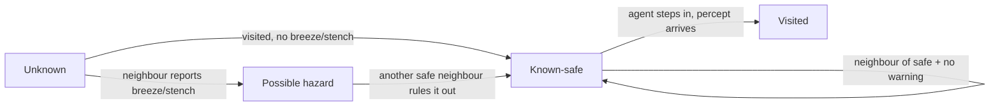

# Pumpkin Agents &mdash; ACS-204 Project Report

> Constructor University Bremen, ACS-204 Artificial Intelligence
> Team: Iaroslav Postovalov (solo)
> Deliverable: a Minecraft (Paper 1.19.4) plugin where pumpkins act as
> rational agents. Each agent uses one of the methods from the course.

> *A note on the command DSL.* Command registration uses
> [plugin-api](https://gitlab.com/CMDR_Tvis/plugin-api), a small Kotlin library
> I wrote in 2019&ndash;2020. It still works on the current server, after a few
> version bumps to keep up with newer Kotlin.

## 1. Introduction

We use Minecraft as the setting for a *thinking-rationally / acting-rationally*
demo (R&N §1, the four paradigms). A pumpkin block on a flat world is a mobile
agent: it senses the cells around it, picks an action, and the game's tick loop
runs that action on the next tick. The game is both the simulator and the
renderer, so we did not have to write either one. The whole project is
**symbolic / GOFAI** (Good Old-Fashioned AI): search, adversarial reasoning,
and propositional logic.

## 2. PEAS & Environment Characterization

| Phase     | Performance                              | Environment           | Actuators                | Sensors              |
|-----------|------------------------------------------|-----------------------|--------------------------|----------------------|
| 0 &mdash; | Reach goal wool                          | Walls, 1 agent        | `MOVE_{N,E,S,W}`, `WAIT` | Full grid            |
| 1 &mdash; | Path length, nodes expanded, ms/decision | Walls, goals, terrain | + `PICKUP`, `DROP`       | Full grid            |
| 2 &mdash; | Score in Pumpkin Tag                     | Walls, 2 agents       | as above                 | Full grid            |
| 3 &mdash; | Safe cells found before a wrong step     | Wumpus world          | as above                 | Local 4-neighborhood |

The properties of the task environment change between phases. Observability
goes from fully observable in phases 0&ndash;2 to partially observable in
phase 3, where the agent sees only local percepts. The environment is
deterministic in every phase, and discrete everywhere: the world is an integer
`(x, z)` grid with four cardinal moves and a small set of cell types.
Phases 0&ndash;1 are episodic (one goal), while phases 2&ndash;3 are sequential.
The environment is static in phases 0&ndash;1, semi-dynamic in phase 2 (the
opponent moves), and static again in phase 3. It is single-agent in phases
0&ndash;1 and 3, and multi-agent in phase 2 (the competitive Pumpkin Tag).

## 3. Architecture

There are three layers, all under `plugin/src/main/kotlin/`:

- Domain (does not depend on the game engine): `world/GridWorld.kt`,
  `agent/{Action, Percept, AgentState, Brain}.kt`,
  `agent/search/SearchProblem.kt`. These are plain data classes plus one
  `Brain` interface. Every brain implements one function that maps the latest
  percept to a chosen action &mdash; the percept→action function from R&N §2.1.
- Brains: `agent/brains/`. Related algorithms share a file.
  `SearchBrain.kt` holds BFS / DFS / UCS / A\*, `MinimaxBrain.kt` holds
  Minimax and α-β, and `PrologBrain.kt` / `ReflexBrain.kt` stand on their own.
  Each brain has unit tests that run without the game, against the same
  `Percept` interface.
- Game integration: a plugin entry point turns the agent on inside the game,
  the `/pumpkin …` commands are registered through the small DSL, and an
  `AgentRuntime` owns the live world and a `Scheduler` that applies actions
  once per tick.

The high-level loop is the same on every tick:


The set of brains matches the course phases. Brains in each phase share the
same `Percept → Action` interface but reason over different things (the map,
the opponent, or a knowledge base):


Each decision tick is atomic. The scheduler collects every agent's chosen
action, resolves conflicts in a fixed way (the lower agent id wins a shared
cell), and then applies all moves in one pass.

The seed is configurable. It is logged when the plugin starts, and every
benchmark run records its seed in the CSV.

## 4. Phase 0 &mdash; Situated Agents

`ReflexBrain` uses the standard right-hand wall-following rule. Its only state
is the agent's facing direction; it keeps no model of the map. On the corridor
map the brain moves one cell per scheduler step toward the goal:

```
########
#......R     ← spawn at (1,1), wall on the left, follow the right hand
########
```

It takes O(n) decisions to cross n cells. It works on any single-room layout
where the goal is somewhere along the right wall.

## 5. Phase 1 &mdash; Moving Agents (Search)

Four search brains (two uninformed, two informed) share one `SearchProblem`
(the five components from R&N §3.1) and a `Node`-based graph search:

- `BfsBrain` &mdash; FIFO frontier. Complete and optimal when all step costs
  are equal.
- `DfsBrain` &mdash; depth-first, with cycle detection and a configurable
  depth limit.
- `UcsBrain` &mdash; Dijkstra: a priority queue keyed on `g`. We run it on the
  `maze_s` map, where `SNOW` patches (cost 3) sit among cost-1 floor, so the
  choice between paths with the same number of steps shows up in the path
  *cost*.
- `AStarBrain` &mdash; a priority queue keyed on `g + h`. It ships with three
  heuristics:
    - `manhattan` &mdash; admissible and consistent.
    - `euclidean` &mdash; admissible, but a looser bound.
    - `diagonalOvershoot` &mdash; deliberately *inadmissible*
      (`(manhattan * 3) / 2`). It shows why optimality needs admissibility: it
      loses the optimality guarantee. On `maze_s` it happens to find the same
      path as BFS (see the table), but on harder layouts it returns a longer
      one.

Comparison on `maze_s` (seed=1234, agent at `(1, 1)`). Each row is a single
decision from the start state. Brains replan every tick, so the *first*
decision is the most informative call:

| Brain           | Ticks to goal | Nodes expanded (1st decision) | Max frontier |
|-----------------|---------------|-------------------------------|--------------|
| BFS             | 26            | 146                           | 11           |
| DFS             | did-not-reach | 27                            | 18           |
| UCS (cost)      | 26            | 147                           | 14           |
| A\* (Manhattan) | 26            | 67                            | 32           |
| A\* (Euclidean) | 26            | 132                           | 33           |
| A\* (overshoot) | 26            | 29                            | 16           |

A\* with the admissible Manhattan heuristic expands about **half** the nodes of
BFS and finds the same 26-step path. The Euclidean heuristic is also admissible
but a looser bound, so it expands almost twice as many nodes as Manhattan. DFS
hits its depth limit on `maze_s` and gives up &mdash; the completeness problem
that R&N §3.4.3 describes. The inadmissible `overshoot` heuristic expands the
fewest nodes (it greedily follows whichever direction *looks* shortest) and on
this map happens to find the same optimal path; on a harder layout it would
not.

## 6. Phase 2 &mdash; Interacting Agents (Pumpkin Tag)

The competitive sub-track is implemented. The state is the pair
`(pred, prey)`. The evaluation function is `−manhattan(pred, prey)`. The prey
is held fixed while the predator thinks &mdash; the current build has no real
adversarial prey, and adding one is a one-class change to `MinimaxBrain`.

`MinimaxBrain` searches all moves to a fixed depth (4 plies by default).
`AlphaBetaBrain` adds α-β pruning. On the `arena` map, with the predator at
`(3,3)`, the prey at `(15,15)`, and depth 3:

| Brain     | Nodes expanded (1st decision) |
|-----------|-------------------------------|
| Minimax   | 19                            |
| AlphaBeta | 13                            |

At this depth on this map, α-β pruning cuts about a third of the explored
states &mdash; within the textbook lower bound of √(bᵈ) under perfect move
ordering &mdash; while choosing the same predator move as plain Minimax (a unit
test checks this). The counts are small because the prey is static during the
predator's search. Giving the prey a real `Brain` would grow the search space
and widen the gap.

## 7. Phase 3 &mdash; Reasoning Agents (Wumpus / first-order KB in Prolog)

`PrologBrain` is the knowledge-based agent from R&N §7. The inference step is
written in **real Prolog** and run by
[2p-kt](https://github.com/tuProlog/2p-kt), a pure-Kotlin Prolog from the
University of Bologna. There is no native bridge and no JPL or SWI-Prolog
install: the solver is a normal JVM library, bundled into the plugin jar.

On each tick the brain rebuilds a small dynamic knowledge base of percept facts
(`visited(X, Z)`, `breeze(X, Z)`, `stench(X, Z)`) from what the agent has
sensed so far, and runs it against a fixed program. The textbook rule &mdash;
a visited cell with no breeze and no stench makes its neighbours safe &mdash;
is written directly as Horn clauses:

```prolog
safe(X, Z) :- visited(X, Z).
safe(X, Z) :- visited(VX, VZ),
              \+ breeze(VX, VZ),
              \+ stench(VX, VZ),
              adjacent(VX, VZ, X, Z).

adjacent(X, Z, X1, Z)  :- X1 is X + 1.
adjacent(X, Z, X1, Z)  :- X1 is X - 1.
adjacent(X, Z, X,  Z1) :- Z1 is Z + 1.
adjacent(X, Z, X,  Z1) :- Z1 is Z - 1.
```

Here `\+` is SLD negation-as-failure and `is/2` is arithmetic evaluation. Both
come from 2p-kt's `DefaultBuiltins`. The query `?- safe(X, Z).` lists every
safe cell under the current KB. The brain intersects that list with the
passable grid to get its set of known-safe cells.

One detail: `\+ breeze(VX, VZ)` raises a wrong `existence_error` when `breeze`
has no clauses. We avoid this by adding three fail-clauses to the fixed
program &mdash; `breeze(_, _) :- fail.` and the same for `stench/2` and
`visited/2` &mdash; so the predicates always exist. The positive ground facts
in the dynamic KB then give the real meaning.

We could use a SAT solver instead, and correctness would be the same: both
R&N §7 and §8 prove Wumpus safety. We chose Prolog because it matches the
textbook syntax closely and we do not have to write the inference engine: we
give 2p-kt the clauses, ask the query, and read the bindings. A propositional
encoding would need an explicit per-cell variable space and one SAT call per
query, while SLD resolution over a few percept facts gives the same answer with
fewer parts.

Path-finding stays in Kotlin. Once the set of safe cells is known, the brain
runs a plain BFS over the safe subgraph to pick its next step. It prefers
unvisited safe neighbours, and once it has the gold it takes the shortest known
path back to the start. The spec asks for Prolog only at the deduction step;
graph search is an algorithm problem, not a logic one.

Each cell goes through a small state machine as the agent learns about it. A
percept can move an *unknown* cell into one of the observed states. The agent
only steps on cells reached through *known-safe* cells:



On the `wumpus_4` map the agent walks only on cells the Prolog solver has
proven safe, grabs the gold when it senses glitter, and walks back to the start
through the same known-safe corridor. The unit tests check that the agent never
steps on a pit or the Wumpus over 200 ticks.

The encoding is *sound*: every cell the solver returns from `safe/2` really is
safe. It is *not complete*: we do not do cross-cell elimination (for example,
"the pit must be at A, because A and B both show a breeze but only A is next to
a fresh breeze"). For the benchmark maps the simpler rule is enough. To close
the gap we would add clauses, not change the engine: the same 2p-kt solver runs
whatever Horn program we give it.

## 8. Discussion & Limitations

Phase 0 is easy on the maps we ship: the right-hand rule reaches the goal on
all of them. A single-cell-thick wall that loops back on itself would break it.
This is worth adding to a risks section in a later revision.

Minimax is one-sided. The prey's moves are scored, but the prey is not a real
player. A second `Brain` on the prey would close the loop, and the `Scheduler`
already supports several agents with deterministic conflict resolution.

The project has no native dependencies. The Wumpus agent runs Prolog inside the
JVM through [2p-kt](https://github.com/tuProlog/2p-kt), so the grader needs
nothing beyond the JDK the Paper server already uses: no JPL, no SWI-Prolog, no
`libjpl.{dylib,so}`, and no `java.library.path`.

## 9. Reproducing the results

Every row in `metrics/metrics.csv` comes from a `/pumpkin run` call. The README
has a script you can copy and paste that drives the in-game commands remotely.
The end-to-end test task runs the same script in CI.

## References

- Russell, Norvig &mdash; *Artificial Intelligence: A Modern Approach*, 4th ed. Chapters 2, 3, 4, 5, 7, 8.
- 2p-kt &mdash; Ciatto, Calegari, Omicini et al., [github.com/tuProlog/2p-kt](https://github.com/tuProlog/2p-kt) (University of Bologna).
- Paper documentation &mdash; [docs.papermc.io](https://docs.papermc.io)
- plugin-api 19.0.2 &mdash; Iaroslav Postovalov (2019&ndash;2020, maintained since), [gitlab.com/CMDR_Tvis/plugin-api](https://gitlab.com/CMDR_Tvis/plugin-api)
